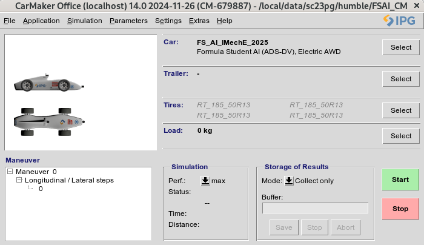

# Setting up IPG Carmaker in Bragg

1. Request a license with [IPG](https://www.ipg-automotive.com/en/support/licenses/formula-carmaker/)
> Key value pairs for the form:
- `Name of the team` : `Leeds Gryphon racing`
- `Host PC name`: Obtain by running: `hostname` on bragg machine
- `MAC address`: Obtain by running `ip addr show` on bragg machine 

> Contact (email) Team Principal: Theo for the `Registration Number`.

2. Once IPG sends you an email follow their instructions to install the IPG Carmaker version 14.0 Office software for linux.

3. Get a local copy of [FSAI_CM](https://leeds365.sharepoint.com/:u:/r/sites/LeedsGryphonRacing/Shared%20Documents/Formula%20Student%20Shared%20Drive/Software/CarMaker_FSAI/FSAI_CM.zip?csf=1&web=1&e=2aXHV3) and unzip it into your `/local/data/$USER` folder

4. Build container with `carmaker.def`
```bash
apptainer build carmaker.sif carmaker.def
```

5. When inside `carmaker.sif`, follow instructions in section **3.2** of `FSAI_CM/doc/FSAI_UsersGuide.md`

**NOTE: Don't forget to apply `Changelog.md` to FSAI_CM**

Running `CMStart.sh` found in top dir of `FSAI_CM` should give you the image below:




IPG Carmaker tutorials can be found in [IPG](https://www.ipg-automotive.com/en/know-how/multimedia/online-tutorials/)

